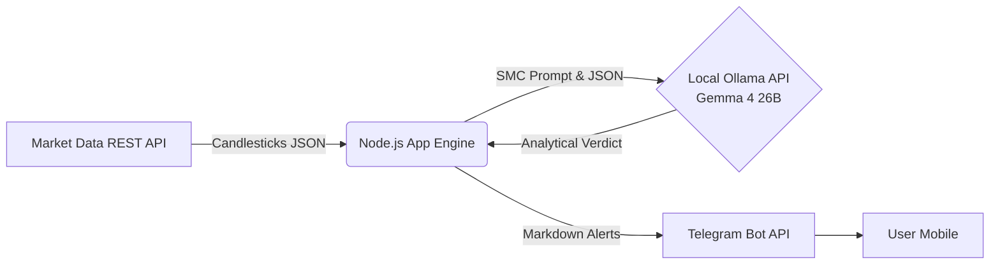

# 🛡️ SMC-Sentinel (Local SMC Trading Bot)

> **Autonomous Forex market scanner powered by a locally hosted Large Language Model.**

SMC-Sentinel is a strictly typed, modular Node.js & TypeScript application designed to act as an autonomous Forex (EUR/USD) market scanner. It leverages the power of a **local LLM (Google Gemma 4 26B via Ollama)** to analyze real-time market structure utilizing **Smart Money Concepts (SMC)** based on the rigorous Dark Trader ruleset.

---

## ✨ Key Features

*   🔒 **Local LLM Integration (Zero Cloud Cost & Privacy):**
    Utilizes the highly capable Google Gemma 4 (26B parameters) locally on Apple Silicon (M-series Macs). This ensures zero API costs, absolute privacy of your trading strategies, and zero external dependencies on cloud providers like OpenAI or Anthropic.
*   ⚡ **Lightning-Fast Real-Time Data Pipeline:**
    Asynchronously fetches Multi-Timeframe (MTF) candlestick data (H1 and M15) from the public Binance REST API. Data is cleanly parsed into a strictly typed JSON array and synchronized with the Kyiv timezone for accurate institutional session analysis.
*   🧠 **Advanced MTF SMC Strategy Engine:**
    Equipped with a finely-tuned, Chain-of-Thought (CoT) system prompt designed to precisely identify critical market footprints across multiple timeframes (HTF Bias + LTF Entry Confirmation):
    *   **Liquidity Sweeps (SFP):** Detection of stops being triggered at Equal Highs/Lows.
    *   **Market Structure Shifts (MSS):** Identification of trend reversals via full-bodied structural breaks.
    *   **Fair Value Gaps (FVG):** Pinpointing three-candle imbalances.
    *   **Premium/Discount Zones:** Evaluating the 50% equilibrium of the current trading range (buys exclusively permitted in the Discount zone).
*   📱 **Smart Telegram Subscriptions & UI:**
    Provides an interactive subscription system (`/subscribe`, `/unsubscribe`) with persistent state storage. A Smart Scheduler dynamically synchronizes the scanning cycles to execute exactly at the close of 15-minute market intervals, sending real-time periodic updates to all active subscribers. It also supports on-demand manual analysis (`/analyze`) and custom conversational prompts.

---

## 🏗️ Architecture

The project strictly adheres to **Clean Architecture** principles, enforcing a clear Separation of Powers. The business logic is deeply decoupled into specialized service modules: `AppEngine`, `MarketDataService`, `OllamaService`, and `TelegramService`.



*Alternatively represented as a linear pipeline:*
`Market API` ➔ `Node.js Core App Engine (TypeScript)` ➔ `Local Ollama REST API (Gemma 4)` ➔ `Telegram Bot API` ➔ `User Mobile`

---

## 🚀 Getting Started

Deploying the SMC-Sentinel locally is straightforward.

### 1. Prerequisites & Installation
Ensure you have Node.js and [Ollama](https://ollama.com/) installed on your machine.
```bash
# Install Node.js dependencies
npm install
```

### 2. Configure Local LLM (Ollama)
The engine is currently tuned for the Gemma 4 (26B) model. It performs exceptionally well for analytical tasks and supports a large context window (up to 32k).
```bash
# Pull and start the model locally
ollama run gemma4:26b
```

### 3. Environment Variables
Create a `.env` file in the root directory. You can use the provided `.env.example` as a template.

```env
# Example .env configuration
MODEL_NAME=gemma4:26b
OLLAMA_API_URL=http://localhost:11434/api/generate
TELEGRAM_TOKEN=your_telegram_bot_token_here
TELEGRAM_CHAT_ID=your_personal_chat_id_here
```

### 4. Build and Run
Compile the TypeScript source code into standard ECMAScript Modules (ESM) and launch the App Engine.
```bash
# Clean the project, build the TypeScript files into the /dist folder
npm run build

# Start the application
npm start
```

---
*Built with ❤️ for algorithmically driven trading.*
