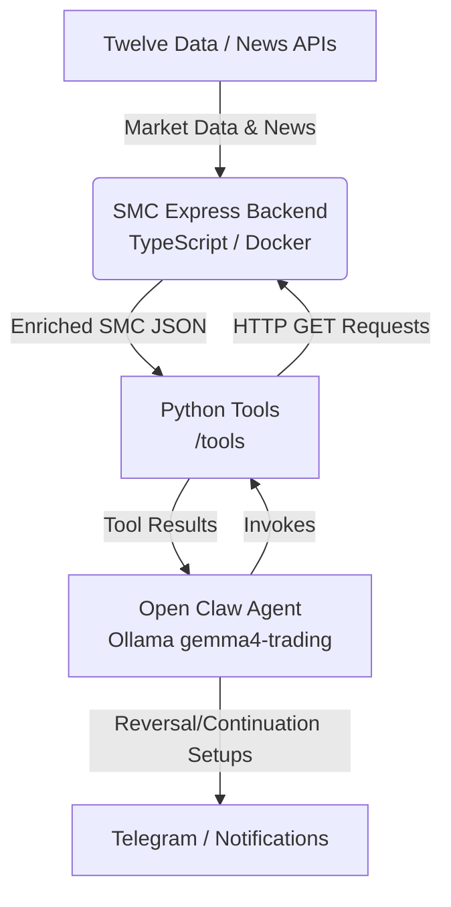

# 🛡️ SMC-Sentinel (Local SMC Trading Bot & Open Claw Backend)

> **Autonomous Forex market scanner and API backend powered by a local Open Claw agent & Google Gemma 4.**

SMC-Sentinel is a strictly typed, modular Node.js & TypeScript application designed to act as an autonomous Forex (EUR/USD) market scanner. It serves a high-performance market data API containerized with Docker, which is queried by a local **Open Claw Agent** utilizing a custom Ollama model (`gemma4-trading`) to analyze market structure based on the institutional Dark Trader Ruleset.

---

## ✨ Key Features

*   🤖 **Open Claw Agent Integration:**
    Fully integrated with the Open Claw desktop agent framework. The agent runs locally using a customized Ollama model built directly from our provided `Modelfile`.
*   🔌 **Enriched Market Data & News API:**
    An Express.js backend serves clean, structured JSON endpoints:
    *   `GET /api/market-data`: Fetches 3-timeframe (H4, M15, M5) candlestick data from Twelve Data and appends deterministic SMC structures (BOS, CHoCH, Premium/Discount zones, Equilibrium, and programmatic FVG/Fractal flags).
    *   `GET /api/todays-high-impact-news`: Fetches Kyiv-time synchronized daily high and medium impact economic news events.
*   🛠️ **Custom Agent Tools:**
    Includes pre-registered Python script tools (`tools/get_market_data.py` and `tools/todays_high_impact_news.py`) that allow the Open Claw agent to dynamically consult the backend API to build market context.
*   🐳 **Docker Infrastructure:**
    The backend server is fully containerized for instant local deployment using Docker Compose, linking environment variables securely.

---

## 🏗️ Architecture



---

## 🚀 Getting Started

Follow these steps to run the backend API and launch the local agent.

### 1. Prerequisites & Installation
Ensure you have Node.js (v20+), Docker, and [Ollama](https://ollama.com/) installed on your machine.

```bash
# Install Node.js dependencies
npm install
```

### 2. Environment Configuration
Create a `.env` file in the root directory. You can use the provided `.env.example` as a template.

```env
PORT=3000
TWELVE_DATA_API_KEY=your_twelve_data_api_key_here
TELEGRAM_TOKEN=your_telegram_bot_token_here
```

### 3. Spin Up the Backend API Server
You can run the server directly or via Docker Compose.

**Via Docker (Recommended):**
```bash
# Build and run the server container
npm run infra:up

# To stop the container
npm run infra:down
```

**Via Local Node.js:**
```bash
# Build TypeScript
npm run build

# Start backend server
npm run start:server
```
The server will start listening at `http://localhost:3000`.

### 4. Build the Local Trading LLM Model
Ensure Ollama is running, then compile the custom model using the repository's `Modelfile`:
```bash
npm run model:build
```
This builds the `gemma4-trading` model from the base `gemma4` configuration with optimal context length and deterministic temperature.

### 5. Launch the Open Claw Agent
To start the Open Claw runtime with our newly built model:
```bash
npm run agent:start
```

---
*Built with ❤️ for algorithmically driven trading.*
